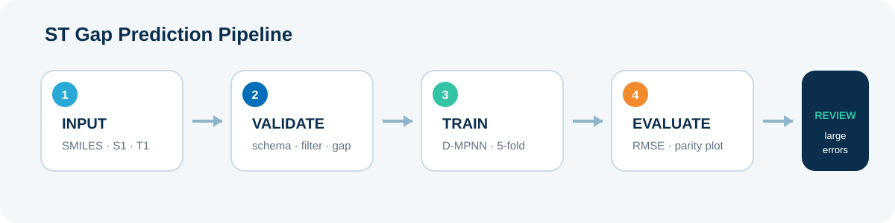
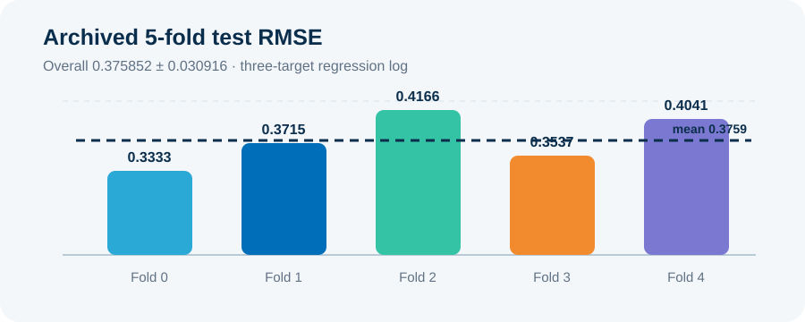

# TADF ST Gap Prediction with ChemProp

분자 구조(SMILES)에서 `S1 energy`, `T1 energy`, `ST Gap`을 예측하고, 교차검증과 오차 사례 분석으로 모델의 신뢰 범위를 확인한 화공전자재료 교과 프로젝트입니다.

> **Project status:** portfolio-ready archive<br>
> **Course:** 성균관대학교 화학공학과 화공전자재료 (2025-2)<br>
> **Model:** ChemProp 1.6.1 D-MPNN, multi-task regression



## 프로젝트 요약

TADF 발광 소재에서는 singlet(`S1`)과 triplet(`T1`) 에너지 차이인 `ST Gap`이 중요한 판단 지표입니다. 양자화학 계산 비용이 큰 문제를 분자 그래프 기반 회귀 문제로 재구성하고, 아래 과정을 수행했습니다.

1. `SMILES`, `S1_energy`, `T1_energy` 스키마를 검증합니다.
2. 비정상 종료 SDF와 알려진 구조 오류 후보를 제외합니다.
3. `ST_GAP(eV) = S1_energy - T1_energy` 파생변수를 생성합니다.
4. ChemProp D-MPNN으로 세 목표값을 동시에 학습합니다.
5. 5-fold 교차검증과 독립 테스트셋으로 성능을 확인합니다.
6. 절대오차가 큰 분자를 정렬해 구조적 실패 사례를 재검토합니다.

## 핵심 결과

| 구분 | 결과 | 해석 |
|---|---:|---|
| 원천 학습 CSV | 30,274 molecules | 공개 저장소에는 원본 데이터 미포함 |
| 추가 dev CSV | 71 molecules | 별도 검증·테스트 구성에 활용 |
| 보존된 실행 로그의 학습 로드 수 | 1,071 molecules | 로그에서 확인된 값으로 원천 규모와 구분 |
| 5-fold overall test RMSE | **0.3759 ± 0.0309** | S1·T1·ST Gap 3개 목표의 ChemProp 실행 로그 |
| 별도 ST Gap parity 분석 | **MAE 0.23 eV / RMSE 0.28 eV** | 100개 테스트 표본의 후처리 분석 요약 |
| 큰 오차 기준 | `abs(error) > 0.3 eV` | 사람이 분자 구조를 재확인하는 예외 규칙 |

두 RMSE 값은 평가 범위가 다르므로 직접 비교하지 않습니다. `0.3759 ± 0.0309`는 ChemProp의 3-target 5-fold 실행 로그이며, `0.28 eV`는 별도 ST Gap parity 분석 결과입니다.



## 제가 수행한 범위

- 원본 CSV 스키마 확인과 ST Gap 파생변수 생성
- SDF 로그의 `Stopping` 문자열 및 구조 오류 후보 필터링
- 고정 시드 기반 학습·테스트 표본 구성
- ChemProp 1.6.1 학습·예측 파이프라인 실행
- 5-fold RMSE와 parity plot을 통한 검증
- `0.3 eV` 초과 오차 표본 정렬 및 RDKit 구조 재확인
- 실험 설정·결과·한계의 문서화

이 저장소의 코드는 수업에서 제공된 ChemProp 실습 흐름을 바탕으로, 포트폴리오 검토와 재현이 쉽도록 다시 모듈화했습니다. ChemProp 자체를 개발한 프로젝트가 아닙니다.

## 저장소 구조

```text
.
├─ data/                         # 데이터 스키마와 공개 범위 안내
├─ docs/
│  ├─ pipeline.svg              # 프로젝트 파이프라인
│  └─ portfolio.pdf             # 화공전자재료 5페이지 포트폴리오
├─ results/
│  ├─ archived_fold_metrics.csv # 보존 실행 로그의 fold별 RMSE
│  ├─ fold_rmse.svg             # fold 편차 시각화
│  └─ README.md                 # 결과 해석과 범위
├─ src/
│  ├─ prepare_data.py           # 스키마 검증·ST Gap 생성·표본화
│  ├─ train_model.py            # ChemProp 5-fold 학습
│  └─ predict_and_evaluate.py   # 예측·지표·parity·오차 사례
├─ tests/
│  └─ test_prepare_data.py
├─ environment.yml
└─ PROJECT_SCOPE.md
```

## 실행 방법

### 1. 환경 구성

```bash
conda env create -f environment.yml
conda activate stgap-chemprop
```

### 2. 데이터 준비

원본 데이터는 수업 자료의 재배포 가능 여부가 확인되지 않아 저장소에 포함하지 않았습니다. `data/README.md`의 스키마를 따르는 CSV를 준비합니다.

```bash
python src/prepare_data.py \
  --inputs data/train.csv data/dev.csv \
  --output data/processed/train_stgap.csv \
  --sample-size 10000 \
  --seed 42
```

### 3. 5-fold 학습

```bash
python src/train_model.py \
  --data data/processed/train_stgap.csv \
  --save-dir artifacts/checkpoints \
  --epochs 100 \
  --folds 5
```

### 4. 예측과 오차 분석

```bash
python src/predict_and_evaluate.py \
  --test-data data/processed/test.csv \
  --checkpoint-dir artifacts/checkpoints \
  --output-dir artifacts/evaluation \
  --error-threshold 0.3
```

## 검증 관점

이 프로젝트의 핵심은 모델 점수 하나가 아니라 평가 절차의 신뢰도입니다.

- **입력 품질:** 결측·비수치·중복·구조 오류 후보를 학습 전에 확인
- **독립 검증:** 학습과 테스트 표본을 분리하고 fold별 편차를 함께 확인
- **재현성:** 데이터 선택, seed, 모델 설정, 평가 임계치를 코드로 고정
- **실패 분석:** 평균 RMSE와 함께 큰 오차 집단을 별도로 검토
- **한계 공개:** 원본 데이터 미공개와 평가 범위 차이를 명시

## 한계와 개선 방향

- 원본 데이터와 SDF 파일은 권리·용량 문제로 공개하지 않았습니다.
- 보존 로그에는 30,274개 원천 자료와 1,071개 로드 실행이 함께 남아 있으나 그 차이를 완전히 재구성할 중간 산출물이 없어, 이 저장소에서는 두 범위를 구분하고 불확실성을 명시합니다.
- 랜덤 분할 외에 scaffold split을 적용하면 새로운 화학 골격에 대한 일반화 성능을 더 엄격하게 검증할 수 있습니다.
- 향후 uncertainty estimation과 applicability domain을 추가하면 휴먼 리뷰 조건을 더 정교하게 설계할 수 있습니다.

## 기술 스택

`Python 3.8` · `ChemProp 1.6.1` · `RDKit` · `PyTorch` · `Pandas` · `NumPy` · `scikit-learn` · `Matplotlib`

## 참고

- ChemProp: Yang et al., *Analyzing Learned Molecular Representations for Property Prediction*, JCIM, 2019
- 이 저장소는 교육·포트폴리오 검토를 위한 프로젝트 아카이브입니다. 데이터와 외부 라이브러리는 각 원저작자와 배포처의 조건을 따릅니다.
